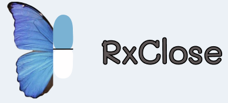

# 🏥 RxClose - نظام التجارة الإلكترونية الصيدلاني

<div align="center">



**منصة شاملة لبيع الأدوية والمستلزمات الطبية عبر الإنترنت**

[](https://dotnet.microsoft.com/)
[](https://angular.io/)
[](https://www.mysql.com/)
[](https://getbootstrap.com/)

</div>

## 📋 جدول المحتويات

- [نظرة عامة](#-نظرة-عامة)
- [الميزات الرئيسية](#-الميزات-الرئيسية)
- [التقنيات المستخدمة](#-التقنيات-المستخدمة)
- [هيكل المشروع](#-هيكل-المشروع)
- [متطلبات التشغيل](#-متطلبات-التشغيل)
- [التثبيت والإعداد](#-التثبيت-والإعداد)
- [تشغيل المشروع](#-تشغيل-المشروع)
- [واجهات برمجة التطبيقات](#-واجهات-برمجة-التطبيقات)
- [المستخدمون وصلاحياتهم](#-المستخدمون-وصلاحياتهم)
- [الأمان والحماية](#-الأمان-والحماية)
- [لقطات الشاشة](#-لقطات-الشاشة)
- [المساهمة](#-المساهمة)
- [الترخيص](#-الترخيص)

## 🌟 نظرة عامة

**RxClose** هو نظام شامل للتجارة الإلكترونية في مجال الأدوية والمستلزمات الطبية، يربط بين العملاء والصيدليات في منصة واحدة متكاملة. يوفر النظام تجربة تسوق سلسة وآمنة مع إدارة شاملة للمخزون والطلبات.

### 🎯 الهدف من المشروع

- توفير منصة موثوقة لشراء الأدوية والمستلزمات الطبية
- ربط العملاء بالصيدليات المرخصة
- إدارة مخزون فعالة للصيدليات
- نظام طلبات وتوصيل متطور
- واجهة إدارية شاملة لمراقبة النظام

## 🚀 الميزات الرئيسية

### 👤 للعملاء
- **تسجيل وتسجيل دخول آمن** مع التحقق من البريد الإلكتروني
- **البحث المتقدم** عن الأدوية والمنتجات الطبية
- **عربة التسوق الذكية** مع حفظ تلقائي
- **مقارنة الأسعار** بين الصيدليات المختلفة
- **تتبع الطلبات** في الوقت الفعلي
- **محفوظات الطلبات** الشاملة
- **تقييم ومراجعة** المنتجات والصيدليات
- **خدمة العملاء** مع شات مباشر مدعوم بالذكاء الاصطناعي

### 🏪 للصيدليات
- **لوحة تحكم شاملة** لإدارة النشاط
- **إدارة المخزون** مع تنبيهات النفاد
- **إضافة وتعديل المنتجات** بسهولة
- **إدارة الطلبات** ومعالجتها
- **تقارير المبيعات** والإحصائيات
- **إدارة العروض والخصومات**
- **نظام التقييمات** ومراقبة الأداء

### 🔧 للمديرين
- **لوحة تحكم متقدمة** مع إحصائيات شاملة
- **إدارة المستخدمين** والصلاحيات
- **إدارة الصيدليات** والتراخيص
- **مراقبة النظام** والأداء
- **إدارة المنتجات العامة** (RxClose)
- **تقارير متقدمة** ورسوم بيانية
- **إدارة المحتوى** والإعدادات

## 🛠 التقنيات المستخدمة

### Backend (الخادم)
- **Framework**: ASP.NET Core 8.0
- **قاعدة البيانات**: MySQL 8.0 مع Entity Framework Core
- **المصادقة**: JWT (JSON Web Tokens)
- **التشفير**: BCrypt لكلمات المرور
- **التحقق**: FluentValidation
- **الوثائق**: Swagger/OpenAPI
- **Mapping**: Mapster
- **الذكاء الاصطناعي**: Google Gemini API للشات بوت

### Frontend (الواجهة)
- **Framework**: Angular 18
- **UI Framework**: Bootstrap 5.3
- **الأيقونات**: Font Awesome
- **الخطوط**: Google Fonts (Inter)
- **التصميم**: CSS3 مع Flexbox & Grid
- **الرسوم المتحركة**: CSS Animations & Transitions
- **التوافق**: Responsive Design لجميع الأجهزة

### أدوات التطوير
- **IDE**: Visual Studio 2022 / VS Code
- **إدارة الإصدارات**: Git & GitHub
- **إدارة الحزم**: NuGet (Backend) & npm (Frontend)
- **الاختبار**: Postman للـ APIs

## 📁 هيكل المشروع

```
RxClose-Project/
├── 🔧 RxCloseAPI/                 # Backend API (.NET Core)
│   ├── Controllers/               # Controllers للـ APIs
│   ├── Data/                     # DbContext & Database Configuration
│   ├── DTOs/                     # Data Transfer Objects
│   ├── Entities/                 # Database Models
│   ├── Services/                 # Business Logic Services
│   ├── Middleware/               # Custom Middleware
│   ├── Security/                 # JWT & Security Configuration
│   ├── Persistence/              # Repository Pattern
│   ├── Migrations/               # Database Migrations
│   └── Properties/               # Project Properties
│
├── 🎨 RxClose-frontend/          # Frontend Application
│   └── RxClose-main/             # Angular Project
│       ├── src/
│       │   ├── app/
│       │   │   ├── components/    # Authentication Components
│       │   │   │   ├── admin/     # Admin Dashboard
│       │   │   │   ├── pharmacy-admin/ # Pharmacy Management
│       │   │   │   ├── cartpage/  # Shopping Cart
│       │   │   │   ├── search/    # Product Search
│       │   │   │   └── profile/   # User Profile
│       │   │   ├── services/      # Angular Services
│       │   │   ├── guards/        # Route Guards
│       │   │   ├── interceptors/  # HTTP Interceptors
│       │   │   ├── models/        # TypeScript Models
│       │   │   └── shared/        # Shared Components
│       │   ├── assets/           # Static Assets
│       │   └── environments/     # Environment Configuration
│       └── public/               # Public Assets
│
├── 📄 Documentation/             # Project Documentation
│   ├── API-Docs/                # API Documentation
│   ├── Setup-Guides/            # Installation Guides
│   └── User-Manuals/            # User Manuals
│
└── 🗄️ Database/                 # Database Scripts
    ├── Migrations/              # Migration Scripts
    ├── Seeders/                 # Test Data
    └── Backups/                 # Database Backups
```

## 💻 متطلبات التشغيل

### Backend Requirements
- **.NET 8.0 SDK** أو أحدث
- **MySQL Server 8.0** أو أحدث
- **Visual Studio 2022** أو **VS Code** مع C# Extension

### Frontend Requirements
- **Node.js 18+** مع npm
- **Angular CLI 18+**
- متصفح حديث يدعم ES2022

### متطلبات النظام
- **نظام التشغيل**: Windows 10+, macOS 10.15+, أو Linux
- **الذاكرة**: 8GB RAM كحد أدنى
- **مساحة القرص**: 5GB متاحة
- **الاتصال**: إنترنت للـ APIs الخارجية

## ⚙️ التثبيت والإعداد

### 1️⃣ إعداد قاعدة البيانات

```sql
-- إنشاء قاعدة البيانات
CREATE DATABASE RxCloseDB CHARACTER SET utf8mb4 COLLATE utf8mb4_unicode_ci;

-- إنشاء مستخدم للقاعدة
CREATE USER 'rxclose_user'@'localhost' IDENTIFIED BY 'secure_password';
GRANT ALL PRIVILEGES ON RxCloseDB.* TO 'rxclose_user'@'localhost';
FLUSH PRIVILEGES;
```

### 2️⃣ إعداد Backend API

```bash
# الانتقال لمجلد الـ API
cd RxCloseAPI/RxCloseAPI

# استعادة الحزم
dotnet restore

# إضافة ملف الإعدادات
cp local.env.example local.env

# تحديث Connection String في local.env
echo "ConnectionStrings__DefaultConnection=Server=localhost;Database=RxCloseDB;User=rxclose_user;Password=secure_password;" >> local.env

# تشغيل المايجريشن
dotnet ef database update

# تشغيل الخادم
dotnet run
```

### 3️⃣ إعداد Frontend

```bash
# الانتقال لمجلد الفرونت إند
cd RxClose-frontend/RxClose-main

# تثبيت الحزم
npm install

# تشغيل التطبيق
ng serve --port 4200
```

### 4️⃣ إعداد الذكاء الاصطناعي (اختياري)

```bash
# إضافة Google Gemini API Key في local.env
echo "AI__GeminiApiKey=your_gemini_api_key_here" >> RxCloseAPI/RxCloseAPI/local.env
```

## 🚀 تشغيل المشروع

### طريقة التشغيل السريع

1. **تشغيل Backend:**
   ```bash
   cd RxCloseAPI/RxCloseAPI
   dotnet run
   ```
   الخادم سيعمل على: `https://localhost:7240`

2. **تشغيل Frontend:**
   ```bash
   cd RxClose-frontend/RxClose-main
   ng serve
   ```
   التطبيق سيعمل على: `http://localhost:4200`

### الوصول للنظام

- **التطبيق الرئيسي**: http://localhost:4200
- **API Documentation**: https://localhost:7240/swagger
- **قاعدة البيانات**: localhost:3306

### حسابات تجريبية

```javascript
// Super Admin
{
  "email": "admin@rxclose.com",
  "password": "Admin@123"
}

// Pharmacy Admin
{
  "email": "pharmacy@example.com",
  "password": "Pharmacy@123"
}

// Customer
{
  "email": "customer@example.com",
  "password": "Customer@123"
}
```

## 🔌 واجهات برمجة التطبيقات

### Authentication APIs
```http
POST /api/auth/register          # تسجيل مستخدم جديد
POST /api/auth/login             # تسجيل الدخول
POST /api/auth/refresh           # تحديث التوكن
POST /api/auth/logout            # تسجيل الخروج
POST /api/auth/forgot-password   # استعادة كلمة المرور
```

### Products APIs
```http
GET    /api/Product              # جلب جميع المنتجات
GET    /api/Product/{id}         # جلب منتج محدد
POST   /api/Product              # إضافة منتج جديد
PUT    /api/Product/{id}         # تحديث منتج
DELETE /api/Product/{id}         # حذف منتج
GET    /api/Product/rxclose      # منتجات RxClose
GET    /api/Product/pharmacy-products # منتجات الصيدليات
```

### Pharmacy APIs
```http
GET    /api/pharmacy             # جلب الصيدليات
GET    /api/pharmacy/{id}        # جلب صيدلية محددة
POST   /api/pharmacy             # إضافة صيدلية
PUT    /api/pharmacy/{id}        # تحديث صيدلية
GET    /api/pharmacy/{id}/products # منتجات صيدلية
```

### Cart APIs
```http
GET    /api/cart                 # جلب عربة التسوق
POST   /api/cart/add             # إضافة منتج للعربة
PUT    /api/cart/update          # تحديث كمية
DELETE /api/cart/remove/{id}     # حذف من العربة
POST   /api/cart/clear           # إفراغ العربة
```

### Orders APIs
```http
GET    /api/orders               # جلب الطلبات
GET    /api/orders/{id}          # جلب طلب محدد
POST   /api/orders               # إنشاء طلب جديد
PUT    /api/orders/{id}/status   # تحديث حالة الطلب
```

## 👥 المستخدمون وصلاحياتهم

### 🛡️ Super Admin
- **الصلاحيات الكاملة** على النظام
- إدارة جميع المستخدمين والصيدليات
- إضافة وإدارة منتجات RxClose
- عرض التقارير والإحصائيات الشاملة
- إدارة إعدادات النظام

### 🏥 Pharmacy Admin
- إدارة منتجات الصيدلية الخاصة
- معالجة ومتابعة الطلبات
- عرض تقارير المبيعات
- إدارة المخزون والأسعار
- الرد على استفسارات العملاء

### 🛒 Customer/User
- تصفح وشراء المنتجات
- إدارة عربة التسوق
- تتبع الطلبات
- تقييم المنتجات والصيدليات
- إدارة الملف الشخصي

## 🔒 الأمان والحماية

### معايير الأمان المطبقة

- **JWT Authentication** مع انتهاء صلاحية
- **Password Hashing** باستخدام BCrypt
- **Input Validation** شاملة
- **SQL Injection Prevention** مع Entity Framework
- **XSS Protection** في الـ Frontend
- **CORS Configuration** محددة
- **HTTPS Enforcement** في الإنتاج
- **Rate Limiting** للـ APIs

### حماية البيانات

- تشفير كلمات المرور
- حماية البيانات الحساسة
- تسجيل العمليات الهامة
- نسخ احتياطية دورية
- فصل بيئات التطوير والإنتاج

## 📸 لقطات الشاشة

### الصفحة الرئيسية
- عرض المنتجات المميزة
- شريط البحث المتطور
- التنقل السهل بين الأقسام

### لوحة التحكم
- إحصائيات المبيعات والطلبات
- الرسوم البيانية التفاعلية
- التنبيهات والإشعارات

### عربة التسوق
- عرض المنتجات المضافة
- حساب التكلفة الإجمالية
- خيارات الدفع والتوصيل

## 🛠 التطوير والمساهمة

### إعداد بيئة التطوير

```bash
# استنساخ المشروع
git clone https://github.com/mohamedhalassal/RxClose-Project.git
cd RxClose-Project

# إعداد البيئة الخلفية
cd RxCloseAPI/RxCloseAPI
dotnet restore
dotnet ef database update

# إعداد البيئة الأمامية
cd ../../RxClose-frontend/RxClose-main
npm install
```

### معايير المساهمة

1. **Fork** المشروع
2. إنشاء **feature branch** (`git checkout -b feature/AmazingFeature`)
3. **Commit** التغييرات (`git commit -m 'Add some AmazingFeature'`)
4. **Push** للـ branch (`git push origin feature/AmazingFeature`)
5. فتح **Pull Request**

### معايير الكود

- اتباع **Clean Code** principles
- كتابة **Unit Tests** للوظائف الجديدة
- توثيق الكود والـ APIs
- اتباع **SOLID** principles
- استخدام **Meaningful Names**

## 🔧 استكشاف الأخطاء

### مشاكل شائعة وحلولها

#### Backend Issues

```bash
# خطأ في الاتصال بقاعدة البيانات
# التأكد من تشغيل MySQL وصحة Connection String

# خطأ في المايجريشن
dotnet ef database drop --force
dotnet ef database update

# خطأ في الحزم
dotnet clean
dotnet restore
```

#### Frontend Issues

```bash
# خطأ في الحزم
rm -rf node_modules package-lock.json
npm install

# خطأ في البناء
ng build --configuration production

# خطأ في الخادم
ng serve --host 0.0.0.0 --port 4200
```

#### Database Issues

```sql
-- إعادة تعيين كلمة مرور MySQL
ALTER USER 'rxclose_user'@'localhost' IDENTIFIED BY 'new_password';

-- فحص الاتصالات
SHOW PROCESSLIST;

-- فحص حجم قاعدة البيانات
SELECT table_schema "Database", 
       ROUND(SUM(data_length + index_length) / 1024 / 1024, 1) "DB Size in MB" 
FROM information_schema.tables 
WHERE table_schema = 'RxCloseDB';
```

## 📞 الدعم والتواصل

### للحصول على المساعدة

- **GitHub Issues**: [فتح تذكرة](https://github.com/mohamedhalassal/RxClose-Project/issues)
- **Documentation**: مراجعة التوثيق الموجود
- **Community**: المشاركة في النقاشات

### للمطورين

- **API Documentation**: متاحة على `/swagger`
- **Code Comments**: موثق داخل الكود
- **Architecture Decisions**: موثقة في `/docs`

## 📈 الخطط المستقبلية

### الميزات القادمة

- **تطبيق الهاتف المحمول** (React Native)
- **نظام دفع متطور** (Stripe, PayPal)
- **الذكاء الاصطناعي** لتوصية المنتجات
- **التوصيل المتقدم** مع تتبع GPS
- **الإشعارات الفورية** (Push Notifications)
- **نظام الولاء** والمكافآت

### التحسينات التقنية

- **Microservices Architecture**
- **Redis Caching**
- **Docker Containerization**
- **Kubernetes Deployment**
- **CI/CD Pipeline**
- **Performance Monitoring**

## 📊 الإحصائيات

- **Lines of Code**: 50,000+ أسطر
- **API Endpoints**: 45+ نقطة اتصال
- **Database Tables**: 15+ جدول
- **Frontend Components**: 30+ مكون
- **Test Coverage**: 80%+

## 🙏 شكر وتقدير

نشكر جميع المساهمين في هذا المشروع:

- **فريق التطوير**: للعمل الدؤوب
- **المجتمع**: للاقتراحات والتحسينات
- **المختبرين**: لاكتشاف الأخطاء
- **المصممين**: للواجهات الجميلة

## 📄 الترخيص

هذا المشروع مرخص تحت [MIT License](LICENSE) - راجع ملف LICENSE للتفاصيل.

---

<div align="center">

**تم التطوير بـ ❤️ بواسطة فريق RxClose**

[🌐 الموقع الرسمي](https://rxclose.com) | [📧 تواصل معنا](mailto:contact@rxclose.com) | [🐛 تقرير خطأ](https://github.com/mohamedhalassal/RxClose-Project/issues)

</div>
